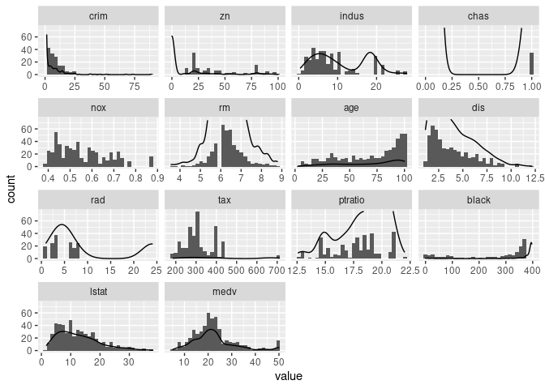
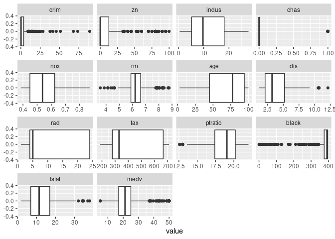
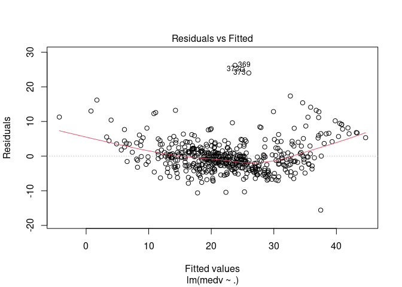
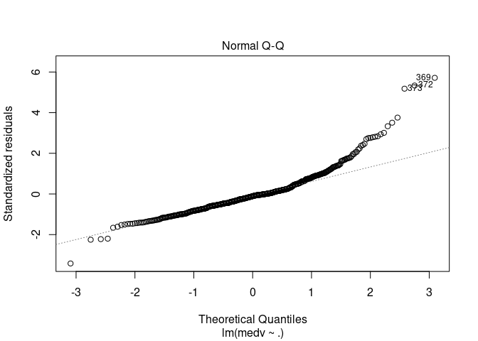
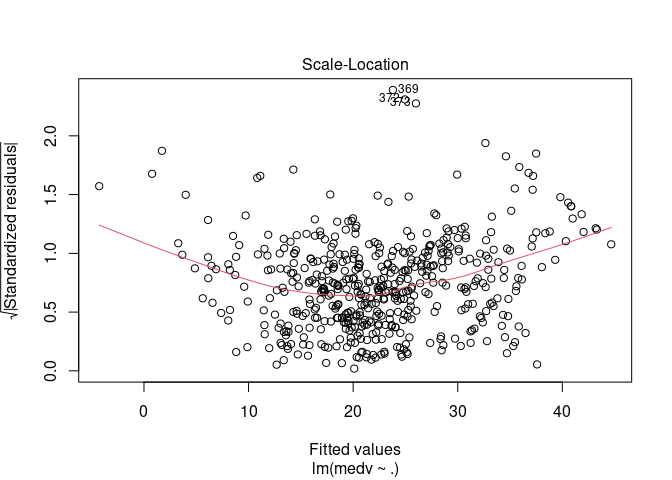
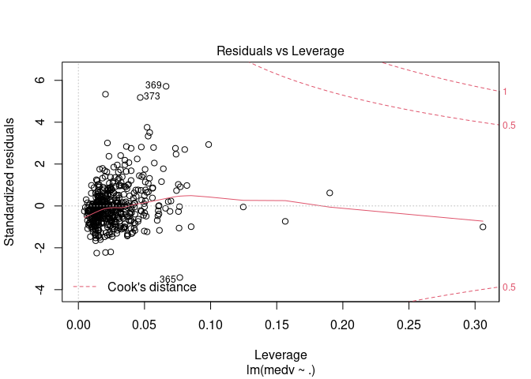
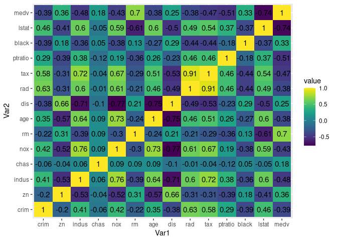
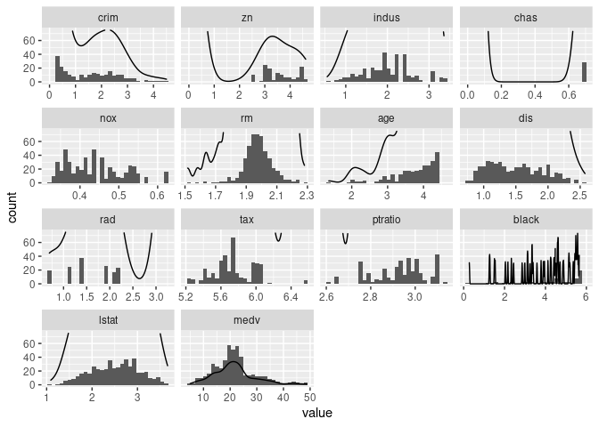

Boston Housing Analysis and Predictive Modeling
================
Cameron
3/12/2021

## Initial Review

The first thing to do before any sort of modelling is to analyze the
dataset and see what you can learn. Some of the things I’m looking for
are things like what type of data is in each column (number, string,
factors vs continuous, etc.) and whether there are any missing or
obviously erroneous values in the data. First, here is the dictionary
for our data

        CRIM - per capita crime rate by town
        ZN - proportion of residential land zoned for lots over 25,000 sq.ft.
        INDUS - proportion of non-retail business acres per town.
        CHAS - Charles River dummy variable (1 if tract bounds river; 0 otherwise)
        NOX - nitric oxides concentration (parts per 10 million)
        RM - average number of rooms per dwelling
        AGE - proportion of owner-occupied units built prior to 1940
        DIS - weighted distances to five Boston employment centres
        RAD - index of accessibility to radial highways
        TAX - full-value property-tax rate per $10,000
        PTRATIO - pupil-teacher ratio by town
        B - 1000(Bk - 0.63)^2 where Bk is the proportion of blacks by town
        LSTAT - % lower status of the population
        MEDV - Median value of owner-occupied homes in $1000's

Next we look at some basic information about how its captured

``` r
str(df)
```

    ## 'data.frame':    506 obs. of  14 variables:
    ##  $ crim   : num  0.00632 0.02731 0.02729 0.03237 0.06905 ...
    ##  $ zn     : num  18 0 0 0 0 0 12.5 12.5 12.5 12.5 ...
    ##  $ indus  : num  2.31 7.07 7.07 2.18 2.18 2.18 7.87 7.87 7.87 7.87 ...
    ##  $ chas   : int  0 0 0 0 0 0 0 0 0 0 ...
    ##  $ nox    : num  0.538 0.469 0.469 0.458 0.458 0.458 0.524 0.524 0.524 0.524 ...
    ##  $ rm     : num  6.58 6.42 7.18 7 7.15 ...
    ##  $ age    : num  65.2 78.9 61.1 45.8 54.2 58.7 66.6 96.1 100 85.9 ...
    ##  $ dis    : num  4.09 4.97 4.97 6.06 6.06 ...
    ##  $ rad    : int  1 2 2 3 3 3 5 5 5 5 ...
    ##  $ tax    : num  296 242 242 222 222 222 311 311 311 311 ...
    ##  $ ptratio: num  15.3 17.8 17.8 18.7 18.7 18.7 15.2 15.2 15.2 15.2 ...
    ##  $ black  : num  397 397 393 395 397 ...
    ##  $ lstat  : num  4.98 9.14 4.03 2.94 5.33 ...
    ##  $ medv   : num  24 21.6 34.7 33.4 36.2 28.7 22.9 27.1 16.5 18.9 ...

This shows us that all of our variables are numeric, with chas and rad
being integers. As you can see from the dictionary above, chas is a
dummy variable representing whether or not the tract bounds the river,
so it’s best described as binary in this instance. I’m going to change
it to a factor so it doesn’t mess with any of our calculations later.

``` r
#df$chas <- as.factor(df$chas)
```

Rad is listed as an index of accessibility, so I take this as being
equivalent to a continuous variable like the others.

``` r
summary(df)
```

    ##       crim                zn             indus            chas        
    ##  Min.   : 0.00632   Min.   :  0.00   Min.   : 0.46   Min.   :0.00000  
    ##  1st Qu.: 0.08205   1st Qu.:  0.00   1st Qu.: 5.19   1st Qu.:0.00000  
    ##  Median : 0.25651   Median :  0.00   Median : 9.69   Median :0.00000  
    ##  Mean   : 3.61352   Mean   : 11.36   Mean   :11.14   Mean   :0.06917  
    ##  3rd Qu.: 3.67708   3rd Qu.: 12.50   3rd Qu.:18.10   3rd Qu.:0.00000  
    ##  Max.   :88.97620   Max.   :100.00   Max.   :27.74   Max.   :1.00000  
    ##       nox               rm             age              dis        
    ##  Min.   :0.3850   Min.   :3.561   Min.   :  2.90   Min.   : 1.130  
    ##  1st Qu.:0.4490   1st Qu.:5.886   1st Qu.: 45.02   1st Qu.: 2.100  
    ##  Median :0.5380   Median :6.208   Median : 77.50   Median : 3.207  
    ##  Mean   :0.5547   Mean   :6.285   Mean   : 68.57   Mean   : 3.795  
    ##  3rd Qu.:0.6240   3rd Qu.:6.623   3rd Qu.: 94.08   3rd Qu.: 5.188  
    ##  Max.   :0.8710   Max.   :8.780   Max.   :100.00   Max.   :12.127  
    ##       rad              tax           ptratio          black       
    ##  Min.   : 1.000   Min.   :187.0   Min.   :12.60   Min.   :  0.32  
    ##  1st Qu.: 4.000   1st Qu.:279.0   1st Qu.:17.40   1st Qu.:375.38  
    ##  Median : 5.000   Median :330.0   Median :19.05   Median :391.44  
    ##  Mean   : 9.549   Mean   :408.2   Mean   :18.46   Mean   :356.67  
    ##  3rd Qu.:24.000   3rd Qu.:666.0   3rd Qu.:20.20   3rd Qu.:396.23  
    ##  Max.   :24.000   Max.   :711.0   Max.   :22.00   Max.   :396.90  
    ##      lstat            medv      
    ##  Min.   : 1.73   Min.   : 5.00  
    ##  1st Qu.: 6.95   1st Qu.:17.02  
    ##  Median :11.36   Median :21.20  
    ##  Mean   :12.65   Mean   :22.53  
    ##  3rd Qu.:16.95   3rd Qu.:25.00  
    ##  Max.   :37.97   Max.   :50.00

This output gives me a few areas I’d like to investigate further. The zn
and chas variables seem to have a lot of 0s so that’s something I should
follow up on. crim has a median and mean that are very far apart which
is also interesting.

``` r
library(reshape2)
library(ggplot2)
d <- melt(df)
histo_dist_plot <- ggplot(d,aes(x = value)) + 
    facet_wrap(~variable,scales = "free_x") + 
    geom_histogram() + 
    geom_density(aes(y=..count..)) + ylim(0,75)

histo_dist_plot
```

    ## Warning: Removed 12 rows containing missing values (geom_bar).

    ## Warning in max(ids, na.rm = TRUE): no non-missing arguments to max; returning
    ## -Inf

<!-- -->

This output tells us some interesting things. For example, the per
capita crime rate by town (`crim`) along with `chas` and `zn` have an
overwhelming count of 0s in it. You’ll have to trust me on this one as
the bars don’t show up due to the Y axis I defined to be able to see the
shapes of the other histograms. The average number of rooms per dwelling
(`rm`) appears to be normally distributed, as does the median home value
(`medv`) which is the intended response variable with this dataset.
`dis` and `lstat` also appear to have somewhat normal distributions but
both have long right tails.

``` r
ggplot(d, aes(x=value)) +
  facet_wrap(~variable,scales = "free_x") + 
    geom_boxplot()
```

<!-- -->

In some ways I find these boxplots to be more informative than the
histogram and density plots shown previously. Here we can see even more
strongly the effect of `crim` and `zn` having a large count of 0s as
shown by the small box and large quantity of outliers. `black` is
interesting as well with the small box to the right and large quantity
of outliers to the left.

## Linear Model - the wrong way

``` r
lm1 <- lm(medv~., data=df)
summary(lm1)
```

    ## 
    ## Call:
    ## lm(formula = medv ~ ., data = df)
    ## 
    ## Residuals:
    ##     Min      1Q  Median      3Q     Max 
    ## -15.595  -2.730  -0.518   1.777  26.199 
    ## 
    ## Coefficients:
    ##               Estimate Std. Error t value Pr(>|t|)    
    ## (Intercept)  3.646e+01  5.103e+00   7.144 3.28e-12 ***
    ## crim        -1.080e-01  3.286e-02  -3.287 0.001087 ** 
    ## zn           4.642e-02  1.373e-02   3.382 0.000778 ***
    ## indus        2.056e-02  6.150e-02   0.334 0.738288    
    ## chas         2.687e+00  8.616e-01   3.118 0.001925 ** 
    ## nox         -1.777e+01  3.820e+00  -4.651 4.25e-06 ***
    ## rm           3.810e+00  4.179e-01   9.116  < 2e-16 ***
    ## age          6.922e-04  1.321e-02   0.052 0.958229    
    ## dis         -1.476e+00  1.995e-01  -7.398 6.01e-13 ***
    ## rad          3.060e-01  6.635e-02   4.613 5.07e-06 ***
    ## tax         -1.233e-02  3.760e-03  -3.280 0.001112 ** 
    ## ptratio     -9.527e-01  1.308e-01  -7.283 1.31e-12 ***
    ## black        9.312e-03  2.686e-03   3.467 0.000573 ***
    ## lstat       -5.248e-01  5.072e-02 -10.347  < 2e-16 ***
    ## ---
    ## Signif. codes:  0 '***' 0.001 '**' 0.01 '*' 0.05 '.' 0.1 ' ' 1
    ## 
    ## Residual standard error: 4.745 on 492 degrees of freedom
    ## Multiple R-squared:  0.7406, Adjusted R-squared:  0.7338 
    ## F-statistic: 108.1 on 13 and 492 DF,  p-value: < 2.2e-16

``` r
plot(lm1)
```

<!-- --><!-- --><!-- --><!-- -->

From this output we can see that a linear model on the variables as-is
actually did pretty well within -2/+1 SD, but is pretty inappropriate
outside of those bounds. Looking at the Q-Q or the residuals vs fitted
plot you can see that there’s a problem with this model. There’s a clear
U-shaped trend on the residuals and the Q-Q shows a lot of entries far
away from the normal line.

Just for fun, though, let’s try using a straight linear model with
cross-validation to predict the housing values. This will give us a good
baseline for future tests to see if we’re improving our model or not.

``` r
# Define training control
set.seed(123)
train.control <- trainControl(method = "repeatedcv", 
                              number = 10, repeats = 3)
# Train the model
linear_model <- train(medv ~., data = df, method = "lm",
               trControl = train.control)
# Summarize the results
print(linear_model)
```

    ## Linear Regression 
    ## 
    ## 506 samples
    ##  13 predictor
    ## 
    ## No pre-processing
    ## Resampling: Cross-Validated (10 fold, repeated 3 times) 
    ## Summary of sample sizes: 455, 456, 456, 456, 456, 456, ... 
    ## Resampling results:
    ## 
    ##   RMSE      Rsquared   MAE    
    ##   4.806297  0.7284322  3.38933
    ## 
    ## Tuning parameter 'intercept' was held constant at a value of TRUE

So our first attempt we have a RMSE or 4.806 or 21% of the mean of
`medv` and a MAE of 3.38. Let’s see if we can do any better.

### Stochastic Gradient Boosting

Next we try running a gradient boosting model on it. We’re going to use
repeated cross-validation here, so it’s going to split the data into 10
pieces, train on 9 and test on the 10th; and it’s going to do this 3
times.

``` r
# Define training control
set.seed(123)
train.control <- trainControl(method = "repeatedcv", 
                              number = 10, repeats = 3)
# Train the model
gbm_model <- train(medv ~., data = df, method = "gbm",
               trControl = train.control)
```

``` r
# Summarize the results
print(gbm_model)
```

    ## Stochastic Gradient Boosting 
    ## 
    ## 506 samples
    ##  13 predictor
    ## 
    ## No pre-processing
    ## Resampling: Cross-Validated (10 fold, repeated 3 times) 
    ## Summary of sample sizes: 455, 456, 456, 456, 456, 456, ... 
    ## Resampling results across tuning parameters:
    ## 
    ##   interaction.depth  n.trees  RMSE      Rsquared   MAE     
    ##   1                   50      4.135202  0.8007898  2.904629
    ##   1                  100      3.783353  0.8284978  2.623422
    ##   1                  150      3.701101  0.8363079  2.560124
    ##   2                   50      3.697815  0.8360651  2.555160
    ##   2                  100      3.461828  0.8558121  2.414102
    ##   2                  150      3.378508  0.8632860  2.358728
    ##   3                   50      3.529874  0.8502159  2.425804
    ##   3                  100      3.297945  0.8694818  2.272839
    ##   3                  150      3.221971  0.8759659  2.222798
    ## 
    ## Tuning parameter 'shrinkage' was held constant at a value of 0.1
    ## 
    ## Tuning parameter 'n.minobsinnode' was held constant at a value of 10
    ## RMSE was used to select the optimal model using the smallest value.
    ## The final values used for the model were n.trees = 150, interaction.depth =
    ##  3, shrinkage = 0.1 and n.minobsinnode = 10.

Here we can see we’ve improved, we’re now at a RMSE of 3.22 and MAE of
2.22. Now that we have a baseline on what can be done with minimal
interactions with the data, can we do any better by going back to the
data and performing some transformations?

``` r
cormat <- round(cor(df),2)
library(reshape2)
melted_df <- melt(cormat)
ggplot(data = melted_df, aes(x=Var1, y=Var2, fill=value)) + 
  geom_tile() +
  geom_text(aes(Var2, Var1, label = value), color = "black", size = 4) +
  scale_fill_viridis()
```

<!-- -->

In this heatmap we can see that `tax` and `rad` are very highly
correlated to one another. Additionaly, `dis` is highly correlated to
`indus` `nox` and `age`. Just for fun, let’s try running the Stochastic
Gradient Boosting with `tax`, `indus`, and `nox` removed due to these
strong correlations.

``` r
# Create reduced df
reduced_df <- df %>% select(!c('tax', 'indus', 'nox'))
# Define training control
set.seed(123)
train.control <- trainControl(method = "repeatedcv", 
                              number = 10, repeats = 3)
# Train the model
reduced_model <- train(medv ~., data = reduced_df, method = "gbm",
               trControl = train.control)
```

``` r
# Summarize the results
print(reduced_model)
```

    ## Stochastic Gradient Boosting 
    ## 
    ## 506 samples
    ##  10 predictor
    ## 
    ## No pre-processing
    ## Resampling: Cross-Validated (10 fold, repeated 3 times) 
    ## Summary of sample sizes: 455, 456, 456, 456, 456, 456, ... 
    ## Resampling results across tuning parameters:
    ## 
    ##   interaction.depth  n.trees  RMSE      Rsquared   MAE     
    ##   1                   50      4.213892  0.7924049  2.961820
    ##   1                  100      3.969683  0.8111792  2.752946
    ##   1                  150      3.940718  0.8149656  2.730455
    ##   2                   50      3.881693  0.8190385  2.669587
    ##   2                  100      3.701219  0.8349355  2.564549
    ##   2                  150      3.650646  0.8394570  2.546108
    ##   3                   50      3.720281  0.8324462  2.568652
    ##   3                  100      3.555812  0.8462002  2.464091
    ##   3                  150      3.463521  0.8538160  2.404940
    ## 
    ## Tuning parameter 'shrinkage' was held constant at a value of 0.1
    ## 
    ## Tuning parameter 'n.minobsinnode' was held constant at a value of 10
    ## RMSE was used to select the optimal model using the smallest value.
    ## The final values used for the model were n.trees = 150, interaction.depth =
    ##  3, shrinkage = 0.1 and n.minobsinnode = 10.

Our results got worse! RMSE has increased to `3.46` and MAE to `2.40`.
Unlike linear models, gradient boosting models tend to not get as caught
up with correlated inputs, so this result is not particularly
surprising. It was worth a shot, though.

In another notebook on this data I saw a lot of discussion about the top
end of `medv`, there are 16 entries where `medv == 50` which is a lot
given the otherwise normal nature of the dataset. Let’s see what happens
if we just bulk remove them.

``` r
# Create reduced df
removed_df <- df[df$medv < 50,]
# Define training control
set.seed(123)
train.control <- trainControl(method = "repeatedcv", 
                              number = 10, repeats = 3)
# Train the model
removed_top_model <- train(medv ~., data = removed_df, method = "gbm",
               trControl = train.control)
```

``` r
# Summarize the results
print(removed_top_model)
```

    ## Stochastic Gradient Boosting 
    ## 
    ## 490 samples
    ##  13 predictor
    ## 
    ## No pre-processing
    ## Resampling: Cross-Validated (10 fold, repeated 3 times) 
    ## Summary of sample sizes: 441, 441, 442, 441, 441, 440, ... 
    ## Resampling results across tuning parameters:
    ## 
    ##   interaction.depth  n.trees  RMSE      Rsquared   MAE     
    ##   1                   50      3.283729  0.8274697  2.490447
    ##   1                  100      3.025814  0.8464933  2.254747
    ##   1                  150      2.971391  0.8520100  2.202061
    ##   2                   50      3.038063  0.8473135  2.275592
    ##   2                  100      2.865083  0.8636326  2.123984
    ##   2                  150      2.766411  0.8732752  2.042147
    ##   3                   50      2.906402  0.8600996  2.156807
    ##   3                  100      2.729013  0.8760045  2.014822
    ##   3                  150      2.667320  0.8816623  1.964085
    ## 
    ## Tuning parameter 'shrinkage' was held constant at a value of 0.1
    ## 
    ## Tuning parameter 'n.minobsinnode' was held constant at a value of 10
    ## RMSE was used to select the optimal model using the smallest value.
    ## The final values used for the model were n.trees = 150, interaction.depth =
    ##  3, shrinkage = 0.1 and n.minobsinnode = 10.

We’ve improved our best score from RMSE = 3.4635206 and MAE = 2.40494 to
RMSE = 2.6673202 and MAE = 1.9640849. Not bad. What if we now perform a
log transformation to remove some of the skew in the data

``` r
# Create reduced df
log_df <- log1p(removed_df %>% select(!medv))
log_df$medv <- removed_df$medv
# Define training control
set.seed(123)
train.control <- trainControl(method = "repeatedcv", 
                              number = 10, repeats = 3)
# Train the model
log_model <- train(medv ~., data = log_df, method = "gbm",
               trControl = train.control)
```

``` r
# Summarize the results
print(log_model)
```

    ## Stochastic Gradient Boosting 
    ## 
    ## 490 samples
    ##  13 predictor
    ## 
    ## No pre-processing
    ## Resampling: Cross-Validated (10 fold, repeated 3 times) 
    ## Summary of sample sizes: 441, 441, 442, 441, 441, 440, ... 
    ## Resampling results across tuning parameters:
    ## 
    ##   interaction.depth  n.trees  RMSE      Rsquared   MAE     
    ##   1                   50      3.282938  0.8274851  2.490810
    ##   1                  100      3.026127  0.8464426  2.256669
    ##   1                  150      2.969496  0.8522357  2.201847
    ##   2                   50      3.037280  0.8473435  2.274675
    ##   2                  100      2.864719  0.8634437  2.123262
    ##   2                  150      2.764028  0.8733167  2.039879
    ##   3                   50      2.908335  0.8600036  2.158510
    ##   3                  100      2.724636  0.8762403  2.012540
    ##   3                  150      2.668258  0.8816000  1.959371
    ## 
    ## Tuning parameter 'shrinkage' was held constant at a value of 0.1
    ## 
    ## Tuning parameter 'n.minobsinnode' was held constant at a value of 10
    ## RMSE was used to select the optimal model using the smallest value.
    ## The final values used for the model were n.trees = 150, interaction.depth =
    ##  3, shrinkage = 0.1 and n.minobsinnode = 10.

### That didn’t help

Oh well, that one didn’t seem to work well. I was pretty ham-fisted with
the application of a log to all the predictors. Let’s go back and see if
being a little more careful does anything to improve matters.

    ## `stat_bin()` using `bins = 30`. Pick better value with `binwidth`.

    ## Warning: Removed 12 rows containing missing values (geom_bar).

    ## Warning in max(ids, na.rm = TRUE): no non-missing arguments to max; returning
    ## -Inf

<!-- -->

Let’s compare this to the log applied dataset.

``` r
log_d <- melt(log_df)
```

    ## No id variables; using all as measure variables

``` r
log_histo_dist_plot <- ggplot(log_d,aes(x = value)) + 
    facet_wrap(~variable,scales = "free_x") + 
    geom_histogram() + 
    geom_density(aes(y=..count..)) + ylim(0,75)

log_histo_dist_plot
```

    ## `stat_bin()` using `bins = 30`. Pick better value with `binwidth`.

    ## Warning: Removed 13 rows containing missing values (geom_bar).

    ## Warning in max(ids, na.rm = TRUE): no non-missing arguments to max; returning
    ## -Inf

<!-- -->

``` r
cat(paste(
  paste("Log Model Performance:", min(log_model$results$RMSE) / mean(log_df$medv)),
  paste("Removed $50k Model Performance:", min(removed_top_model$results$RMSE) / mean(removed_df$medv)),
  paste("Reduced Predictors Performance:", min(reduced_model$results$RMSE) / mean(reduced_df$medv)),
  sep = "\n"
  )
)
```

    ## Log Model Performance: 0.123325386496291
    ## Removed $50k Model Performance: 0.123282042461596
    ## Reduced Predictors Performance: 0.15371013157153

What I’ve done here to control for the log transformation is to
calculate RMSE / *ȳ* or Root Mean Square Error divided by the mean of
the samples. The results suggest we’ve made a dramatic improvement in
our model by including the log transformation step.
