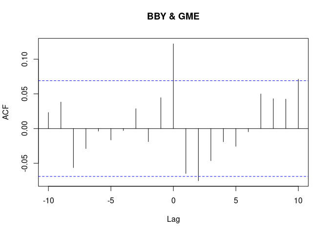

Can’t Stop Won’t Stop
================
Cameron
3/18/2021

## Correlations

Everyone is talking about Gamestop these days and I can’t deny there’s
an interesting story there, I’m just not sure exactly what it is. I was
reading one person’s take on it the other day and they were describing
how they believe that there will be some major market movement whenever
the ball finally drops on the short interest in that stock. One of the
main thrusts of their argument was to say that Gamestop has been
inversely correlated with the market overall and that this is due to the
short interests having to sell other stocks - dropping their price - in
order to have money to make Gamestop purchases or re-up on their short
inerest, which increases Gamestop’s price. Seems reasonable, and I too
have noticed that Gamestop has - at least recently - been performing the
opposite of the rest of the market. This workbook is my effort to prove
- or disprove - this correlation.

For the purposes of this workbook, I will only be going as granular as
daily performance. I don’t have a good way right now for intraday data.

First, we’re going to load our data. For simplicity’s sake, I’m just
going to compare *G**M**E* to *S**P**Y*

``` r
symbols <- c("GME", "SPY", "BBY")
stock_returns <- symbols %>%
    tq_get(get  = "stock.prices",
           from = "2018-01-01",
           to   = Sys.Date()) 

stock_returns_daily <- stock_returns %>%
  group_by(symbol) %>%
  tq_transmute(select      = adjusted,
               mutate_fun  = periodReturn,
               period      ="daily",
               col_rename  = "Ra")
```

``` r
GME <- stock_returns_daily$Ra[stock_returns_daily$symbol == "GME"]
SPY <- stock_returns_daily$Ra[stock_returns_daily$symbol == "SPY"]
BBY <- stock_returns_daily$Ra[stock_returns_daily$symbol == "BBY"]
ccfvalues <- ccf(SPY, GME, 10)
```

<!-- -->

``` r
ccfvalues
```

    ## 
    ## Autocorrelations of series 'X', by lag
    ## 
    ##    -10     -9     -8     -7     -6     -5     -4     -3     -2     -1      0 
    ## -0.023  0.064 -0.056 -0.003 -0.009  0.015  0.026 -0.008 -0.008 -0.004  0.103 
    ##      1      2      3      4      5      6      7      8      9     10 
    ## -0.066 -0.014  0.006 -0.010 -0.043 -0.006  0.034 -0.014  0.051  0.013

``` r
astsa::lag2.plot(SPY, GME,10)
```

<!-- -->

From this output we can say pretty conclusively that, at least in the
daily numbers, *G**M**E* and *S**P**Y* are not closely correlated. All
of the correlation coefficients are less than 0.10 and there is a lot of
variance from one day to the next. For comparison, let’s see how it
would fare against a similar business, *B**B**Y*.

``` r
bbyccfvalues <- ccf(BBY,GME,10)
```

<!-- -->

``` r
bbyccfvalues
```

    ## 
    ## Autocorrelations of series 'X', by lag
    ## 
    ##    -10     -9     -8     -7     -6     -5     -4     -3     -2     -1      0 
    ##  0.023  0.038 -0.056 -0.029 -0.004 -0.016 -0.003  0.029 -0.019  0.045  0.122 
    ##      1      2      3      4      5      6      7      8      9     10 
    ## -0.065 -0.075 -0.046 -0.019 -0.026 -0.005  0.050  0.043  0.042  0.071

Here we can see that there is indeed a correlation between GME and BBY,
though not a particularly strong one. What’s interesting is that GME
appears to predict BBY instead of the other way around. You can see this
in how the largest bars from the above chart are when Lag is &gt;0.
We’re going to try and predict *B**B**Y* using *G**M**E* with a 1 and 2
day lag using a linear model. Let’s see how this goes…

``` r
x <- cbind(lag(GME), lag(GME, n=2))
y <- BBY
linear_model <- lm(y~x)
summary(linear_model)
```

    ## 
    ## Call:
    ## lm(formula = y ~ x)
    ## 
    ## Residuals:
    ##       Min        1Q    Median        3Q       Max 
    ## -0.151654 -0.011399  0.000914  0.012559  0.165023 
    ## 
    ## Coefficients:
    ##               Estimate Std. Error t value Pr(>|t|)  
    ## (Intercept)  0.0012902  0.0008932   1.444   0.1490  
    ## x1          -0.0142668  0.0087654  -1.628   0.1040  
    ## x2          -0.0171498  0.0087654  -1.957   0.0507 .
    ## ---
    ## Signif. codes:  0 '***' 0.001 '**' 0.01 '*' 0.05 '.' 0.1 ' ' 1
    ## 
    ## Residual standard error: 0.02524 on 803 degrees of freedom
    ##   (2 observations deleted due to missingness)
    ## Multiple R-squared:  0.008932,   Adjusted R-squared:  0.006463 
    ## F-statistic: 3.618 on 2 and 803 DF,  p-value: 0.02726

From this output we can see that while there does appear to be a linear
correlation between *G**M**E* 1-day and 2-day lag against *B**B**Y*, the
P values are above the 5% threshold so I would generally accept the null
hypothesis that there is no correlation. Additionally, the R-squared is
only 0.01 so even if they were significant it doesn’t explain enough of
the *B**B**Y* movement to be worth caring about.

## Recent History

So we’ve proven that overall, from 2018-today there’s no correlation
between *G**M**E* and *S**P**Y*, and that while there is a slight
correlation between *G**M**E* and *B**B**Y* it’s not enough for a linear
model within a 95% confidence interval. But let’s go back to the
original problem - Gamestop’s recent volatility appearing to be linked
negatively to the market. Perhaps our window is too large. Let’s re-run
the analysis looking only at what’s happened from January 13, 2021
forward. January 13th is when there was a 57% price jump in a single day
and a massive spike in trading volume.

``` r
stock_returns_daily_reduced <- stock_returns[stock_returns$date >= as.Date("2021-01-13"),] %>%
  group_by(symbol) %>%
  tq_transmute(select      = adjusted,
               mutate_fun  = periodReturn,
               period      ="daily",
               col_rename  = "Ra")
```

``` r
GME_reduced <- stock_returns_daily$Ra[stock_returns_daily$symbol == "GME"]
SPY_reduced <- stock_returns_daily$Ra[stock_returns_daily$symbol == "SPY"]
BBY_reduced <- stock_returns_daily$Ra[stock_returns_daily$symbol == "BBY"]
ccfvalues_reduced <- ccf(SPY_reduced, GME_reduced, 10)
```

<!-- -->

``` r
ccfvalues_reduced
```

    ## 
    ## Autocorrelations of series 'X', by lag
    ## 
    ##    -10     -9     -8     -7     -6     -5     -4     -3     -2     -1      0 
    ## -0.023  0.064 -0.056 -0.003 -0.009  0.015  0.026 -0.008 -0.008 -0.004  0.103 
    ##      1      2      3      4      5      6      7      8      9     10 
    ## -0.066 -0.014  0.006 -0.010 -0.043 -0.006  0.034 -0.014  0.051  0.013

``` r
astsa::lag2.plot(SPY_reduced, GME_reduced,10)
```

<!-- -->

Once again, we see there is no meaningful correlation nor predictive
value. Sorry, reddit poster. It looks like your premise is flawed. I
think that’s about it for that theory today.
